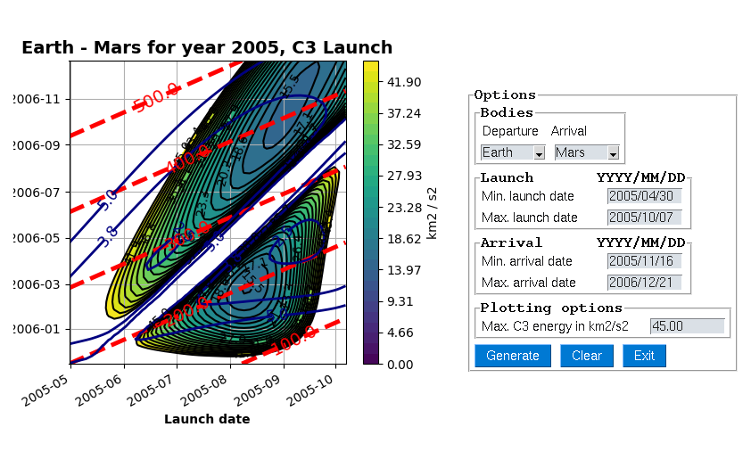

Porkchop widget
===============

This repository contains a simple GUI for solving porkchops. Porkchops are
figures which show all the possible span of solutions for the Lambert's problem
in terms of the C3 parameter. In this case, this GUI only shows the departure
energy value, which can be fixed from the options frame.

Installation
------------
This code only requires two Python packages to run: poliastro and PySimpleGUI.
The first one is used to solve for the porkchop figure and the second one
enables user to configure which are the different parameters for the figure to
be generate.

* **poliastro** https://github.com/poliastro/poliastro
* **PySimpleGUI** https://github.com/PySimpleGUI/PySimpleGUI

Once you have installed both packages, you can simply run:

.. code-block:: python
   
    python porkchop_widget.py

Previous command will run the actual software, which does not require to be
installed in your machine either forms any Python package by itself.

How to use
----------
Once the program launches, it is possible to select departure and arrival bodies
together with the different time spans. Default values are placed for user to
test a very famoous porkchop from NASA bwtween Earth and Mars. Furthermore, the
C3 departure parameter is set to be 45.00 km2/s2 by default.

**Notice that this is a hard-computational problem since we are solving the
Lambert's problem for each launch-arrival combination. Therefore you might wait
a couple of seconds before the porkchop figure is actually displayed. Do not
worry about this.**

About
-----
This was only a simple exercise I selected in order to learn PySimpleGUI in a
funny way. No maintainance is expected either more features for the moment.
Please refer to previously cited dependencies (poliastro an PySimpleGUI) in case
you are interested in the mathematics/algorithms behind the computations or the
GUI workflow respectively.
